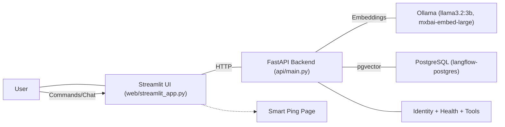
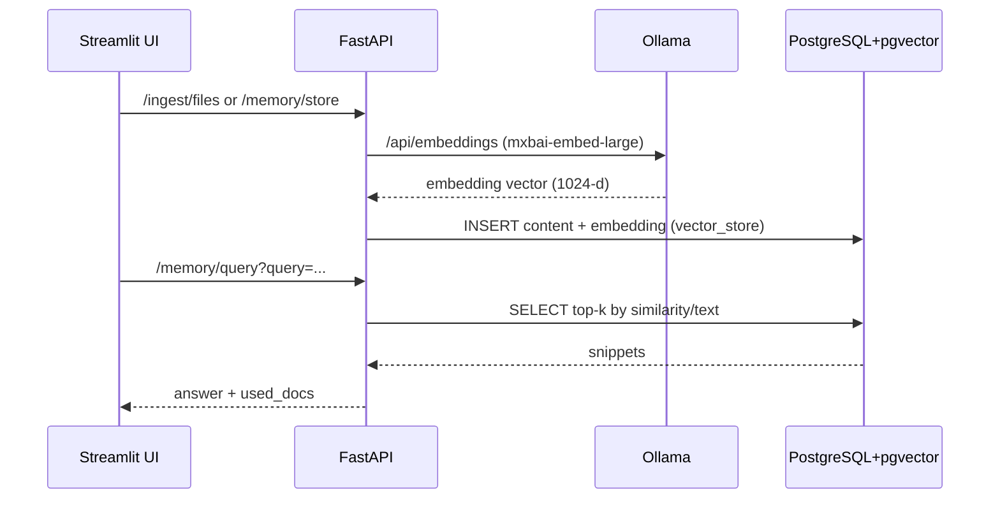
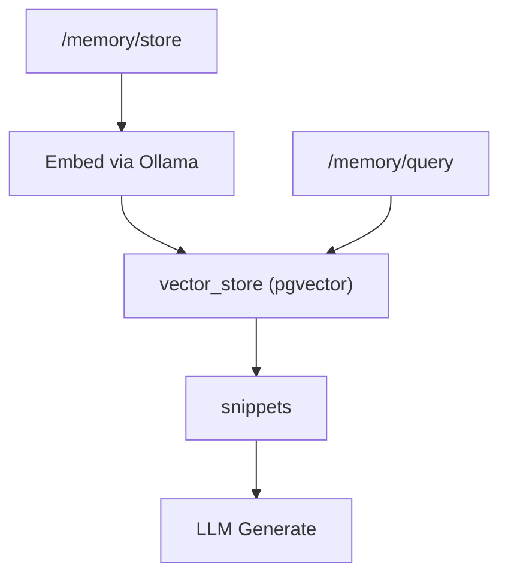

## Overview

This repository implements a 7-layer agent system with an operational FastAPI backend, Streamlit UI, Smart Scout automated tests, PostgreSQL (pgvector) memory, and Ollama LLM integration. The system supports instance identity, smart ping/tracing, tool-enabled chat, document ingestion, and RAG.

Repository: [Kausiukas/capstone_project_demo1](https://github.com/Kausiukas/capstone_project_demo1)

## Architecture (Mermaid)



## Critical Data Flow (Mermaid)



## Quick Start (local)

```bash
pip install -r requirements.txt
streamlit run web/streamlit_app.py --server.port 8501
```

Backend (Docker):

```bash
docker compose up -d --build api
# Ensure api container can reach ollama and postgres (bridge network)
```

Key environment variables:
- API_KEY: demo_key_123
- LLM_PROVIDER: ollama
- OLLAMA_BASE: http://<ollama_host_or_ip>:11434
- OLLAMA_CHAT_MODEL: llama3.2:3b
- OLLAMA_EMBED_MODEL: mxbai-embed-large
- DATABASE_URL: postgresql://langflow_user:langflow_password@<db_host_or_ip>:5432/langflow_connect

## Endpoints (highlights)

- Identity/Health:
  - GET `/identity`
  - GET `/health`
- Memory:
  - POST `/memory/store` (StoreBody: user_input, response)
  - GET `/memory/query?query=...&k=5`
  - GET `/memory/documents?limit=20`
- Ingestion:
  - POST `/ingest/files` (multipart form)
- Chat:
  - POST `/chat/message` (session_id, message, top_k)
  - POST `/chat/stream`
- Tools:
  - GET `/tools/list`
  - POST `/api/v1/tools/call`

## Tool-Enabled Chat

Chat can execute tools automatically or on explicit commands:

- List documents (explicit):
  - `!list_docs 20`
- Natural language trigger:
  - “what files/documents are present in the database?”

Response includes a concise list plus the full data payload. Works in `/chat/message` and `/chat/stream`.

## Smart Scout (Mesh-aware)

Run full readiness test and generate report:

```bash
python scripts/run_mesh_scout.py
```

Output: `results/scout_reports/scout_report_<timestamp>.json`

## Layer 6 (Memory) Mesh (Mermaid)



## LangGraph Sketch (illustrative)

```python
from langgraph.graph import Graph

g = Graph()
g.add_node("ingest")
g.add_node("embed")
g.add_node("store")
g.add_node("retrieve")
g.add_node("generate")

g.add_edge("ingest", "embed")
g.add_edge("embed", "store")
g.add_edge("retrieve", "generate")

# In practice map nodes to your concrete functions/endpoints
```

## Troubleshooting

- Ollama 404/connection: ensure models are pulled (`mxbai-embed-large`, `llama3.2:3b`) and API can reach the ollama host/IP.
- DB auth/role errors: confirm container env (`POSTGRES_USER=langflow_user`, etc.) and `DATABASE_URL` points to the actual service (avoid host.docker.internal unless intended).
- DNS issues between containers: connect `capstone_api` to the `bridge` network or use service IPs.

## Streamlit Cloud Notes

- Include `requirements.txt` with `streamlit`, `requests` and any client-side deps.
- Ensure the app entry is `web/streamlit_app.py` (or adjust).
- API URL and key should be set via Streamlit secrets or environment.

## Repository Layout (selected)

- `api/main.py`: FastAPI backend (identity, memory, tools, chat)
- `web/streamlit_app.py`: Streamlit UI
- `scripts/run_mesh_scout.py`: Mesh-aware Smart Scout launcher
- `scripts/test_critical_postgresql_embeddings.py`: critical store/retrieve tests
- `7_agent_layers/`: design specs, maps, and diagrams per layer

## Seven-Layer Architecture Overview

### Layers at a glance
- **Layer 1 – Human Interface (95%)**: Streamlit dashboard (tool testing, content preview, performance, topology, API docs). Chat (stream + history), semantic search, file ingestion.
- **Layer 2 – Information Gathering (90%)**: Collectors (files/HTTP/system), normalizers, context synthesis, validators. AI‑enhanced ingestion with local Ollama and pgvector indexing.
- **Layer 3 – Structure, Goals & Behaviors (75%)**: Goal management and website optimization signals; local resource learning; personality/ethics scaffolding.
- **Layer 4 – Agent Brain (45%)**: LLM adapter (Ollama + mock) implemented; reasoning, planning, decision stubs and flows defined.
- **Layer 5 – Tools & API (75%)**: Tool registry, orchestrator, execution engine; MCP tools (ping/read/list/status/analyze); security and metrics.
- **Layer 6 – Memory & Feedback (85%)**: pgvector memory, short‑term window + autosummary, feedback‑weighted ranking, chat history, endpoints.
- **Layer 7 – Infra, Scaling & Security (80%)**: Docker/Compose (API, Postgres+pgvector, Ollama), health checks, API keys & headers, monitoring; deployment paths.

### System diagram (Mermaid)
```mermaid
graph TB
  U[User] --> L1[Layer 1 UI]
  L1 --> API[FastAPI Backend]

  subgraph Core (L2-L6)
    L2[Info Gathering] --> DB[(PostgreSQL + pgvector)]
    L6[Memory & Feedback] --> DB
    L5[Tools & API] --> MCP[MCP Tools]
    L4[Agent Brain] --> L5
    L4 --> L6
    L2 --> L6
  end

  API --> L2
  API --> L4
  API --> L5
  API --> L6
  API --> MON[Monitoring]
  API --> OLL[Ollama]

  L7[Infra & Security] -. manages .- API
  L7 -. manages .- DB
  L7 -. manages .- OLL
  L7 -. monitors .- MON
```

### Representative use cases
- Chat with memory using local models (streaming + history; feedback tunes retrieval)
- Document ingestion and semantic search (enhanced extraction + structured storage)
- Code/repo analysis via tools (read, list, analyze) from the dashboard
- Operational visibility: metrics, health checks, topology, warmup/walkthrough scripts

### Near‑term roadmap
- L4 Reasoning/Planning: evidence‑tracked chain‑of‑thought, plan validation, cost/latency‑aware decisions
- L5 Orchestration: DAG/parallel flows, result aggregation, budget policies
- L6 Consolidation/Learning: nightly consolidate/summarize, HNSW, learning analytics
- L7 Security/Scaling: token‑bucket rate limits, key rotation, autoscaling, SLOs/error budgets
- L1 UI/UX: voice I/O, multilingual UI, accessibility

## License

MIT License
